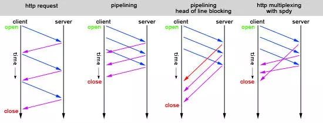

# http

1. 说一下 Http 缓存策略，有什么区别，分别解决了什么问题？[链接](https://github.com/lgwebdream/FE-Interview/issues/14)

<details>
<summary>答案</summary>

1. 浏览器缓存策略

浏览器每次发起请求时，先在本地缓存中查找结果以及缓存标识，根据缓存标识来判断是否使用本地缓存。如果缓存有效，则使用本地缓存；否则，则向服务器发起请求并携带缓存标识。根据是否需向服务器发起HTTP请求，将缓存过程划分为两个部分：强制缓存和协商缓存，强缓优先于协商缓存。

* 强缓存，服务器通知浏览器一个缓存时间，在缓存时间内，下次请求，直接用缓存，不在时间内，执行比较缓存策略。
* 协商缓存，让客户端与服务器之间能实现缓存文件是否更新的验证、提升缓存的复用率，将缓存信息中的Etag和Last-Modified 通过请求发送给服务器，由服务器校验，返回304状态码时，浏览器直接使用缓存。

HTTP缓存都是从第二次请求开始的：

* 第一次请求资源时，服务器返回资源，并在response header中回传资源的缓存策略；
* 第二次请求时，浏览器判断这些请求参数，击中强缓存就直接200，否则就把请求参数加到request header头中传给服务器，看是否击中协商缓存，击中则返回304，否则服务器会返回新的资源。这是缓存运作的一个整体流程图：


2. 强缓存

* 强缓存命中则直接读取浏览器本地的资源，在network中显示的是from memory或者from disk
* 控制强制缓存的字段有：Cache-Control（http1.1）和Expires（http1.0）
* Cache-control是一个相对时间，用以表达自上次请求正确的资源之后的多少秒的时间段内缓存有效。
* Expires是一个绝对时间。用以表达在这个时间点之前发起请求可以直接从浏览器中读取数据，而无需发起请求
* Cache-Control的优先级比Expires的优先级高。前者的出现是为了解决Expires在浏览器时间被手动更改导致缓存判断错误的问题。

如果同时存在则使用Cache-control。

3. 强缓存-expires

* 该字段是服务器响应消息头字段，告诉浏览器在过期时间之前可以直接从浏览器缓存中存取数据。
* Expires 是 HTTP 1.0 的字段，表示缓存到期时间，是一个绝对的时间 (当前时间+缓存时间)。在响应消息头中，设置这个字段之后，就可以告诉浏览器，在未过期之前不需要再次请求。
* 由于是绝对时间，用户可能会将客户端本地的时间进行修改，而导致浏览器判断缓存失效，重新请求该资源。此外，即使不考虑修改，时差或者误差等因素也可能造成客户端与服务端的时间不一致，致使缓存失效。
* 优势特点
    * HTTP 1.0 产物，可以在HTTP 1.0和1.1中使用，简单易用。
    * 以时刻标识失效时间。
* 劣势问题
    * 时间是由服务器发送的(UTC)，如果服务器时间和客户端时间存在不一致，可能会出现问题。
    * 存在版本问题，到期之前的修改客户端是不可知的。

4. 强缓存-cache-control

* 已知Expires的缺点之后，在HTTP/1.1中，增加了一个字段Cache-control，该字段表示资源缓存的最大有效时间，在该时间内，客户端不需要向服务器发送请求。
* 这两者的区别就是前者是绝对时间，而后者是相对时间。下面列举一些 Cache-control 字段常用的值：(完整的列表可以查看MDN)
    * max-age：即最大有效时间。
    * must-revalidate：如果超过了 max-age 的时间，浏览器必须向服务器发送请求，验证资源是否还有效。
    * no-cache：不使用强缓存，需要与服务器验证缓存是否新鲜。
    * no-store: 真正意义上的“不要缓存”。所有内容都不走缓存，包括强制和对比。
    * public：所有的内容都可以被缓存 (包括客户端和代理服务器， 如 CDN)
    * private：所有的内容只有客户端才可以缓存，代理服务器不能缓存。默认值。
* Cache-control 的优先级高于 Expires，为了兼容 HTTP/1.0 和 HTTP/1.1，实际项目中两个字段都可以设置。
* 该字段可以在请求头或者响应头设置，可组合使用多种指令：
    * 可缓存性
        * public：浏览器和缓存服务器都可以缓存页面信息
        * private：default，代理服务器不可缓存，只能被单个用户缓存
        * no-cache：浏览器器和服务器都不应该缓存页面信息，但仍可缓存，只是在缓存前需要向服务器确认资源是否被更改。可配合private，过期时间设置为过去时间。
        * only-if-cache：客户端只接受已缓存的响应
    * 到期
        * max-age=：缓存存储的最大周期，超过这个周期被认为过期。
        * s-maxage=：设置共享缓存，比如can。会覆盖max-age和expires。
        * max-stale=：客户端愿意接收一个已经过期的资源
        * min-fresh=：客户端希望在指定的时间内获取最新的响应
        * stale-while-revalidate=：客户端愿意接收陈旧的响应，并且在后台一部检查新的响应。时间代表客户端愿意接收陈旧响应的时间长度。
        * stale-if-error=：如新的检测失败，客户端则愿意接收陈旧的响应，时间代表等待时间。
    * 重新验证和重新加载
        * must-revalidate：如页面过期，则去服务器进行获取。
        * proxy-revalidate：用于共享缓存。
        * immutable：响应正文不随时间改变。
    * 其他
        * no-store：绝对禁止缓存
        * no-transform：不得对资源进行转换和转变。例如，不得对图像格式进行转换。

* 优势特点
    * HTTP 1.1 产物，以时间间隔标识失效时间，解决了Expires服务器和客户端相对时间的问题。
    * 比Expires多了很多选项设置。
* 劣势问题
    * 存在版本问题，到期之前的修改客户端是不可知的。

5. 协商缓存

* 协商缓存的状态码由服务器决策返回200或者304
* 当浏览器的强缓存失效的时候或者请求头中设置了不走强缓存，并且在请求头中设置了If-Modified-Since 或者 If-None-Match 的时候，会将这两个属性值到服务端去验证是否命中协商缓存，如果命中了协商缓存，会返回 304 状态，加载浏览器缓存，并且响应头会设置 Last-Modified 或者 ETag 属性。
* 协商缓存在请求数上和没有缓存是一致的，但如果是 304 的话，返回的仅仅是一个状态码而已，并没有实际的文件内容，因此 在响应体体积上的节省是它的优化点。
* 协商缓存有 2 组字段(不是两个)，控制协商缓存的字段有：Last-Modified/If-Modified-since（http1.0）和 Etag/If-None-match（http1.1）
* Last-Modified/If-Modified-since表示的是服务器的资源最后一次修改的时间；Etag/If-None-match表示的是服务器资源的唯一标
识，只要资源变化，Etag就会重新生成。
* Etag/If-None-match的优先级比Last-Modified/If-Modified-since高。

6. 协商缓存-协商缓存-Last-Modified/If-Modified-since

    1. 服务器通过 Last-Modified 字段告知客户端，资源最后一次被修改的时间，例如 Last-Modified: Mon, 10 Nov 2018 09:10:11 GMT
    2. 浏览器将这个值和内容一起记录在缓存数据库中。
    3. 下一次请求相同资源时时，浏览器从自己的缓存中找出“不确定是否过期的”缓存。因此在请求头中将上次的 Last-Modified 的值写入到请求头的 If-Modified-Since 字段
    4. 服务器会将 If-Modified-Since 的值与 Last-Modified 字段进行对比。如果相等，则表示未修改，响应 304；反之，则表示修改了，响应 200 状态码，并返回数据。

* 优势特点
    * 不存在版本问题，每次请求都会去服务器进行校验。服务器对比最后修改时间如果相同则返回304，不同返回200以及资源内容。
* 劣势问题
    * 只要资源修改，无论内容是否发生实质性的变化，都会将该资源返回客户端。例如周期性重写，这种情况下该资源包含的数据实际上一样的。
    * 以时刻作为标识，无法识别一秒内进行多次修改的情况。 如果资源更新的速度是秒以下单位，那么该缓存是不能被使用的，因为它的时间单位最低是秒。
    * 某些服务器不能精确的得到文件的最后修改时间。
    * 如果文件是通过服务器动态生成的，那么该方法的更新时间永远是生成的时间，尽管文件可能没有变化，所以起不到缓存的作用。

7. 协商缓存-Etag/If-None-match

* 为了解决上述问题，出现了一组新的字段 Etag 和 If-None-Match
* Etag 存储的是文件的特殊标识(一般都是 hash 生成的)，服务器存储着文件的 Etag 字段。之后的流程和 Last-Modified 一致，只是 Last-Modified 字段和它所表示的更新时间改变成了 Etag 字段和它所表示的文件 hash，把 If-Modified-Since 变成了 If-None-Match。服务器同样进行比较，命中返回 304, 不命中返回新资源和 200。
* 浏览器在发起请求时，服务器返回在Response header中返回请求资源的唯一标识。在下一次请求时，会将上一次返回的Etag值赋值给If-No-Matched并添加在Request Header中。服务器将浏览器传来的if-no-matched跟自己的本地的资源的ETag做对比，如果匹配，则返回304通知浏览器读取本地缓存，否则返回200和更新后的资源。
* Etag 的优先级高于 Last-Modified。

* 优势特点
    1. 可以更加精确的判断资源是否被修改，可以识别一秒内多次修改的情况。
    2. 不存在版本问题，每次请求都回去服务器进行校验。

* 劣势问题
    1. 计算ETag值需要性能损耗。
    2. 分布式服务器存储的情况下，计算ETag的算法如果不一样，会导致浏览器从一台服务器上获得页面内容后到另外一台服务器上进行验证时现ETag不匹配的情况。
</details>
<br><br>

2. 常见 http 请求头有哪些，他们的作用？

<details>
<summary>答案</summary>

* Accept 请求头用来告知（服务器）客户端可以处理的内容类型，这种内容类型用MIME类型来表示。借助内容协商机制, 服务器可以从诸多备选项中选择一项进行应用，并使用 Content-Type 应答头通知客户端它的选择。
* Accept-Charset 告知（服务器）客户端可以处理的字符集类型。
* Accept-Language 告知客户端期望获得的语言。
* User-Agent 客户端白标识，让服务端可以识别浏览器。
* Cache-Control 通用消息头字段，被用于在http请求和响应中，通过指定指令来实现缓存机制。缓存指令是单向的，这意味着在请求中设置的指令，不一定被包含在响应中。

```js

Cache-Control: max-age=<seconds> // 设置缓存存储的最大周期，超过这个时间缓存被认为过期(单位秒)。
Cache-Control: max-stale[=<seconds>] // 表明客户端愿意接收一个已经过期的资源。可以设置一个可选的秒数，表示响应不能已经过时超过该给定的时间。
Cache-Control: min-fresh=<seconds> // 表示客户端希望获取一个能在指定的秒数内保持其最新状态的响应。
Cache-control: no-cache // 在发布缓存副本之前，强制要求缓存把请求提交给原始服务器进行验证(协商缓存验证)。
Cache-control: no-store // 缓存不应存储有关客户端请求或服务器响应的任何内容，不使用任何缓存。
Cache-control: no-transform // 不得对资源进行转换或转变。Content-Encoding、Content-Range、Content-Type等HTTP头不能由代理修改。
Cache-control: only-if-cached // 表明客户端只接受已缓存的响应，并且不要向原始服务器检查是否有更新的拷贝。

```

* Connection 决定当前的事务完成后，是否会关闭网络连接。如果该值是“keep-alive”，网络连接就是持久的，不会关闭，使得对同一个服务器的请求可以继续在该连接上完成。

* Host 请求头指明了请求将要发送到的服务器主机名和端口号。

* If-Modified-Since 是一个条件式请求首部，服务器只在所请求的资源在给定的日期时间之后对内容进行过修改的情况下才会将资源返回，状态码为 200  。如果请求的资源从那时起未经修改，那么返回一个不带有消息主体的  304  响应，而在 Last-Modified 首部中会带有上次修改时间。 不同于  If-Unmodified-Since, If-Modified-Since 只可以用在 GET 或 HEAD 请求中。

当与 If-None-Match 一同出现时，它（If-Modified-Since）会被忽略掉，除非服务器不支持 If-None-Match。

最常见的应用场景是来更新没有特定 ETag 标签的缓存实体。

* If-None-Match 是一个条件式请求首部。对于 GETGET 和 HEAD 请求方法来说，当且仅当服务器上没有任何资源的 ETag 属性值与这个首部中列出的相匹配的时候，服务器端会才返回所请求的资源，响应码为  200  。对于其他方法来说，当且仅当最终确认没有已存在的资源的  ETag 属性值与这个首部中所列出的相匹配的时候，才会对请求进行相应的处理。

* ETag 是资源的特定版本的标识符。这可以让缓存更高效，并节省带宽，因为如果内容没有改变，Web服务器不需要发送完整的响应。而如果内容发生了变化，使用ETag有助于防止资源的同时更新相互覆盖（“空中碰撞”）。

* Cookie 含有先前由服务器通过 Set-Cookie 首部投放并存储到客户端的 HTTP cookies。
</details>
<br><br>

3. https 和 http 的区别是什么？https 为什么安全？怎么配置？

<details>
<summary>答案</summary>

1. 区别
    * HTTPS在浏览器显示绿色安全锁，HTTP没有显示;
    * HTTPS基于传输层，HTTP基于应用层
    * https 需要申请去 CA 申请证书，需要付费
    * http 报文信息是明文传输；https 是具有安全性的 ssl/tls 加密传输协议。这样的后果是 http 的内容可能会被窃听。https 内容经过对称加密，更安全
    * http 无法验证报文的完整性，因此无法知道数据是否被篡改。https 内容传输经过完整性校验。
    * http 协议中的请求和响应不会对通信方进行确认。由于不存在确认通信方的处理步骤，任何人都可以发起请求。另外，服务器只要接收到请求，不管对方是谁都会返回一个响应（但也仅限于发送端的IP地址和端口号没有被Web服务器设定限制访问的前提下）HTTP协议无法验证通信方身份，任何人都可以伪造虚假服务器欺骗用户，实现“钓鱼欺诈”，用户无法察觉。https 第三方无法伪造服务端（客户端）身份。
    * http 和 https 默认使用端口不同，http 80，https 443
2. 为什么 https 更安全？
    * HTTPS并非是应用层的一种新协议。只是HTTP通信接口部分用SSL（Secure Socket Layer）和TLS（Transport Layer Security）协议代替而已。通常，HTTP直接和TCP通信。当使用SSL时，则演变成先和SSL通信，再由SSL和TCP通信了。简言之，所谓HTTPS，其实就是身披SSL协议这层外壳的HTTP。在采用SSL后，HTTP就拥有了HTTPS的加密、证书和完整性保护这些功能。也就是说HTTP加上加密处理和认证以及完整性保护后即是HTTPS。
    * TLS/SSL 的功能实现主要依赖于三类基本算法：散列函数 、对称加密和非对称加密，其利用非对称加密实现身份认证和密钥协商，对称加密算法采用协商的密钥对数据加密，基于散列函数验证信息的完整性。
    * 解决内容可能被窃听的问题 --> 加密。具体做法是：发送密文的一方使用对方的公钥进行加密处理“对称的密钥”，然后对方用自己的私钥解密拿到“对称的密钥”，这样可以确保交换的密钥是安全的前提下，使用对称加密方式进行通信。所以，HTTPS采用对称加密和非对称加密两者并用的混合加密机制。
    * 解决报文可能遭篡改问题 --> 数字签名。发送者将一段文本先用Hash函数生成消息摘要，然后用发送者的私钥加密生成数字签名，与原文文一起传送给接收者。接下来就是接收者校验数字签名的流程了。接收者只有用发送者的公钥才能解密被加密的摘要信息，然后用HASH函数对收到的原文产生一个摘要信息，与上一步得到的摘要信息对比。如果相同，则说明收到的信息是完整的，在传输过程中没有被修改，否则说明信息被修改过，因此数字签名能够验证信息的完整性。
    * 下面是 https 的完整流程：
        1. 1.Client发起一个HTTPS（比如https://juejin.im/user/5a9a9cdcf265da238b7d771c）的请求，根据RFC2818的规定，Client知道需要连接Server的443（默认）端口。
        2. Server把事先配置好的公钥证书（public key certificate）返回给客户端。
        3. Client验证公钥证书：比如是否在有效期内，证书的用途是不是匹配Client请求的站点，是不是在CRL吊销列表里面，它的上一级证书是否有效，这是一个递归的过程，直到验证到根证书（操作系统内置的Root证书或者Client内置的Root证书）。如果验证通过则继续，不通过则显示警告信息。
        4. Client使用伪随机数生成器生成加密所使用的对称密钥，然后用证书的公钥加密这个对称密钥，发给Server。
        5. Server使用自己的私钥（private key）解密这个消息，得到对称密钥。至此，Client和Server双方都持有了相同的对称密钥。
        6. Server使用对称密钥加密“明文内容A”，发送给Client。
        7. Client使用对称密钥解密响应的密文，得到“明文内容A”。
        8. Client再次发起HTTPS的请求，使用对称密钥加密请求的“明文内容B”，然后Server使用对称密钥解密密文，得到“明文内容B”。
3. 为什么并不是所有网站都采用 https？
    * https 需要选择、购买、部署证书，耗时费力。
    * https 性能消耗大。与纯文本通信相比，加密通信会消耗更多的CPU及内存资源。但事实并非如此，用户可以通过性能优化、把证书部署在SLB或CDN，来解决此问题。因此HTTPS经过优化之后其实并不慢
    * 想要节约购买证书的开销也是原因之一
4. 怎么配置？
    1. Tomcat
        * 申请证书。证书由第三方 CA 认证机构颁发，网站所有者向 CA 机构申请证书，证书中包含了公钥、颁证机构、网址、失效日期。如果网站使用假冒证书，浏览器向 CA 认证机构发送证书是否合法的请求，如果检测到是非法的，浏览器直接断开请求。
        * 证书部署到 tomcat。配置 SSL 连接器，将 www.domain.com.jks 文件存放到 config 目录下，然后配置同级目录下的 server.xml 文件：
        ```xml
            <Connector
            port="443"
            protocol="HTTP/1.1"
            SSLEnabled="true"
            maxThreads="150"
            scheme="https"
            secure="true"
            keystoreFile="conf/www.domain.com.jks"
            keystorePass="changeit"
            clientAuth="false"
            sslProtocol="TLS"
            />
        ```
        这个是让 http 自动跳转到 https ，安全配置在 conf 目录下的 web.xml。在后面的倒数第二段继续添加：

        ```xml
            <login-config>
                <!-- Authorization setting for SSL -->
                <auth-method>CLIENT-CERT</auth-method>
                <realm-name>Client Cert Users-only Area</realm-name>
            <login-config>
            <security-constraint>
                <!-- Authorization setting for SSL -->
                <web-resource-collection>
                    <web-resource-name>SSL</web-resource-name>
                    <url-pattern>/*</url-pattern>
                </web-resource-collection>
                <user-data-constraint>
                    <transport-guarantee>CONFIDENTIAL</transport-guarantee>
                </user-data-constraint>
            </security-constraint>
        ```
        这步是让非 ssl 的 connector 跳转到 ssl 的 connector 去。所以还需要在 server.xml 配置：
        
        ```xml
            <Connector
            port="8080"
            protocol="HTTP/1.1"
            connectionTimeout="20000"
            redirectPort="443"
            >
        ```
        重启 tomcat，输入 https 网址，测试是否访问成功。
    2. Nginx
        * 申请证书
        * 确保具有 ssl 模块，如果没有就安装
            1. 安装基础支持包
            ```shell
                yum -y install openssl openssl-devel
            ```
            2. 备份原 nginx.conf 文件为 nginx.conf.bak 以防万一
            3. 安装 ssl 模块
            ```shell
                cd /home/nginx-1.10.2
                ../configure --with-http_ssl_module
                make
                make install
            ```
        * 配置服务器。配置 Nginx.conf，将下载的证书和 key 的所在位置配置到配置文件上。具体如下：
        ```
            server {    
                listen 443; #监听443端口（https默认端口）
                server_name www.xxx.com; #填写绑定证书的域名
                ssl on;
                ssl_certificate xxx.crt; #填写你的证书所在的位置
                ssl_certificate_key xxx.key; #填写你的key所在的位置
                ssl_session_timeout 5m;
                ssl_protocols TLSv1 TLSv1.1 TLSv1.2; #按照这个协议配置
                ssl_ciphers ECDHE-RSA-AES128-GCM-SHA256:HIGH:!aNULL:!MD5:!RC4:!DHE; #按照这个套件配置
                ssl_prefer_server_ciphers on;
                location / {
                        root  xxx ; #填写你的你的站点目录
                        index index.php index.html index.htm;
                }
            }
        ```
        * 进行 http 80 端口的访问重定向配置
        ```
            server {
                listen 80;
                server_name  www.xxx.com; #填写绑定证书的域名
                rewrite ^ https://$http_host$request_uri? permanent; # 将http转到https
            }
        ```
        * 重启服务器。在重启服务器前先检验配置文件是否由错误：
        ```
            nginx -t # 如果没有错误就重启服务器
            service nginx restart
        ```
</details>
<br><br>

5. http 1 和 http 2 有什么区别，和 http 1.1 相比，http 2 都有什么特性？

<details>
<summary>答案</summary>

* http 1.0 和 http 1.1 的区别
    * 缓存处理。在 http 1.0 中主要使用 header 里的 if-Modified-Since，Expires 来做为缓存判断的标准，http 1.1 则引入更多的缓存控制策略，例如 ETag，if-Unmodified-Since，if-Match，if-None-Match 等更多可供选择的缓存头来控制缓存策略。
    * 带宽优化及网络连接的使用。http 1.0 中，存在一些浪费带宽的现象，例如客户端只需要某个对象的一部分，而服务器却将整个对象送过来了，而且不支持断点续传功能，http 1.1 则在请求头引入 range 头域，它允许只请求资源的某个部分，即返回码是 206 (partial content)。
    * 错误通知的管理。http 1.1 中新增了 24 个错误状态码，如 409 （conflict）表示请求的资源与资源的当前状态发生冲突；410（gone）表示服务器上的某个资源被永久性删除。
    * host 头处理。http 1.0 中认为每台服务器都绑定一个唯一的 ip 地址，因此，请求消息中的 url 并没有传递主机名（hostname）。但随着虚拟主机技术的发展，每一台物理服务器上可以存在多个虚拟主机（multi-homed web servers），并且他们共享一个 ip 地址。http 1.1 的请求消息和响应消息都应支持 host 头域，且请求消息中如果没有 host 头域会报告一个错误。（400 bad request）举例来说，将三个不同的服务部署在同一个域名下，这样服务器收到客户端请求后需要知道请求对应哪个具体的服务，所以就需要客户端传递 host 头。
    * 长连接，http 1.1 支持长连接（persistentConnection）和请求的流水线（pipelining）处理，在一个 tcp 连接上可以发送多个 http 请求和响应，减少建立和关闭连接的消耗和延迟，在 http 1.1 中默认开启 Connection: keep-alive，一定程度上弥补了 http 1.0 每次请求都要创建连接的缺点。
* http 1.x 优化
    2012 年 google 提出了 SPDY 方案，优化了 http 1.x 的全球延迟，解决了 http 1.x 的安全性
    * 降低延迟。spdy 采用多路复用（multiplexing）。多路复用通过多个请求 stream 共享一个 tcp 连接的方式，解决了 HOL blocking（队头阻塞 Head-of-Line blocking） 的方式，降低了延迟同时提高了带宽的利用率。
    * 请求优先级。(request prioritization)。多路复用带来一个新的问题，在连接共享的基础上有可能会导致关键请求被阻塞。SPDY允许给每个请求设置优先级，这样重要的请求就会优先得到响应。比如浏览器加载首页，首页的 html 内容应该优先展示，之后才是各种静态资源文件，脚本文件等加载，这样可以保证用户能第一时间看到页面内容。
    * header压缩。http 1.x 的 header 有很多重复的。压缩后可以减小包的大小和数量。
    * 基于 https 的加密协议，提高了传输数据的可靠性
    * 服务端推送（server push），采用了 SPDY 的网页，如果网页有 style.css 的请求，收到 style.css 数据的同时，服务端会将 style.js 推送给客户端，当客户端尝试获取 style.js 的时候就可以直接从缓存中获取，不需要再次请求。
* http 2.0 SPDY 的升级版
    http 2.0 是 SPDY 的升级版，是基于 SPDY 设计的，但是也有不同之处：
    * http 2.0 支持明文 http 传输，SPDY 强制使用 https
    * http 2.0 消息头的压缩算法使用 HPACK，而非 spdy 的 DEFLATE
* http 2.0 和 http 1.x 相比的新特性
    1. 新的二进制格式（binary format）
    http 1.x 基于文本，http 2.0 使用二进制格式。
    2. 多路复用（multiplexing）
    http 2.0 中有两个概念，流（stream）和帧（frame），frame 是最小的单位，每个 frame 会有 stream identifier 来标识它是属于哪个 stream。在 http 1.x 下，每个 http 请求都会建立一个 tcp 连接，也就意味着每个请求都要进行三次握手，造成时间和资源的浪费，而且浏览器会限制同一域名下并发请求的个数，请求很多资源的时候，队头阻塞会导致在达到最大请求数时，剩余的资源要等待其他资源请求完成才能发起请求（这种情况的优化手段时，把不同资源放在不同域名下，以此突破浏览器最大并发数的限制）。
    
    在 http2 的情况下，所有的请求都会共用一个 tcp 连接，就可以传输所有的请求数据。这就解决了浏览器同一域名请求数量的问题，也解决了每开一个 tcp 连接都会造成的浪费。
    
    同一个 tcp 连接下的多个 http 请求，怎么保证传输不出错？这就要提到多路复用了。就是在一个 tcp 连接中可以存在多个 stream，也就是多个请求，每个 stream 又包含多个 frame，通过 stream identifier 就可以识别出每个 frame 分别对应的 stream，当 frame 到达服务端后，根据 stream identifier 重新组合得到完整的请求，这就在提高传输性能的同时保证了传输的正确性。

    简单来说，多路复用即连接共享，即每一个请求都是用作连接共享机制的。一个请求对应一个 id，这样一个连接上可以有多个请求，每个连接的请求可以随机混杂在一起，接收方根据请求的 id 将请求归属到不同的服务端请求里。
    3. header 压缩
    http 1.x 中用文本的形式传输 header 每次都会带上，这些基本都是不变的。

    http2 使用 HPACK 压缩格式对 header 进行了编码，减少了 header 的大小，大概原理就是在服务端和客户端共同维护一个静态字典，用于记录出现过的 header ，后面在传输过程中发送端之间传输已经记录的键名，接收端就可以通过键名找到对应的值。

    简洁解释： http 1.x 的 header 带有大量信息，每次都要重复发送， http 2.0 使用 encoder 减少需要传输的 header 大小，通讯双方各自 cache 一份 header fields 表，既避免了重复 header 的传输，减少了传输大小。
    4. 服务端 push
    http 2.0 中，服务端可以在客户端的某个请求后，根据这个请求，主动推送其他资源。比如一个 html 页面中含有一个 css 和 js 的资源请求， http 1.x 就需要发送三次请求， http 2.0 中，不用请求三次，服务器发现了 html 中包含了 css 和 js，便将三个资源一起都返回了客户端，这样只需要一次通信，就获取到了全部资源。
* 扩展
    1. http 2.0 的多路复用和 http 1.x 中的长连接复用有什么区别？
        * http 1.x 一次请求响应，建立一个连接，用完关闭，每一个请求都要建立一个连接。
        * http 1.1 pipeling 一次性发送多个request请求。然而 pipelining 在接收 response 返回时，也必须依顺序接收，如果前一个请求遇到了阻塞，后面的请求即使已经处理完毕了，仍然需要等待阻塞的请求处理完毕。第一个请求阻塞后，后面的请求都需要等待，这也就是队头阻塞(Head of line blocking)。
        * http2 中提出了多路复用(Multiplexing)技术，http2 中将多个请求复用同一个 tcp 链接中，将一个 TCP 连接分为若干个流（Stream），每个流中可以传输若干消息（Message），每个消息由若干最小的二进制帧（Frame）组成。也就是将每个 request-response 拆分为了细小的二进制帧Frame，这样即使一个请求被阻塞了，也不会影响其他请求。
    2. 服务端推送到底是什么？
        * 服务端推送能够把客户端需要的资源伴随着 index.html 一起发送到客户端，省去了重复请求的步骤。
    3. 为什么需要头部压缩？
        * 假如一个页面有 100 个资源需要加载，每一次请求都有 1kb 的消息头，则至少需要消耗 100 kb来获取这些消息头。http 2.0 可以维护一个字典，差量更新 http 头部，降低了因为头部产生的流量。
    4. http 2.0 多路复用有多好？
        * http 性能优化的关键不在于高带宽，而是低延迟。tcp 连接会随着时间进行自我调谐，起初会限制连接的最大速度，如果数据传输成功，会随着时间的推移提高传输的速度。这种调谐被称为 tcp 慢启动。由于这种原因，让原本具有突发性和短时性的 http 连接变得十分低效。 http 2.0 通过让所有数据流共用同一个连接，可以更有效得使用 tcp连接，让高带宽也能真正服务于 http 性能提升。
</details>
<br><br>

6. http 报文的组成部分？

<details>
<summary>答案</summary>

1. 请求报文
    * 请求行（request line）包含用于请求的方法字段，url 字段和 http 版本
    * 请求头（header）
        * User-Agent 产生请求的浏览器类型
        * Accept 客户端可识别的内容型列表
        * Host 主机地址
    * 请求数据 post 方法会把数据以 key-value 形式发送
    * 空行 回车符和换行符，将每一行数据隔开
2. 响应报文
    * 状态行 包含响应结果的状态码，原因短语和 http 版本
    * 响应头 服务器类型，日期，长度，内容类型等
    * 响应正文 内容数据
</details>
<br><br>

7. 一个 TCP 连接可以发多少个 http 请求？

<details>
<summary>答案</summary>

要搞懂这个问题，先解决下面五个问题：

1. 现代浏览器在与服务器建立了一个 TCP 连接后是否会在一个 HTTP 请求完成后断开？什么情况下会断开？

在 HTTP/1.0 中，一个服务器在发送完一个 HTTP 响应后，会断开 TCP 链接。但是这样每次请求都会重新建立和断开 TCP 连接，代价过大。所以虽然标准中没有设定，某些服务器对 Connection: keep-alive 的 Header 进行了支持。完成这个 HTTP 请求之后，不要断开 HTTP 请求使用的 TCP 连接。这样的好处是连接可以被重新使用，之后发送 HTTP 请求的时候不需要重新建立 TCP 连接，以及如果维持连接，那么 SSL 的开销也可以避免。

持久连接：既然维持 TCP 连接好处这么多，HTTP/1.1 就把 Connection 头写进标准，并且默认开启持久连接，除非请求中写明 Connection: close，那么浏览器和服务器之间是会维持一段时间的 TCP 连接，不会一个请求结束就断掉。

所以第一个问题的答案是：默认情况下建立 TCP 连接不会断开，只有在请求报头中声明 Connection: close 才会在请求完成后关闭连接。


2. 一个 TCP 连接可以对应几个 HTTP 请求？

如果维持连接，一个 TCP 连接是可以发送多个 HTTP 请求的。只要没有断开，就没有数量限制。

3. 一个 TCP 连接中 HTTP 请求发送可以一起发送么（比如一起发三个请求，再三个响应一起接收）？

HTTP/1.1 存在一个问题，单个 TCP 连接在同一时刻只能处理一个请求，意思是说：两个请求的生命周期不能重叠，任意两个 HTTP 请求从开始到结束的时间在同一个 TCP 连接里不能重叠。

虽然 HTTP/1.1 规范中规定了 Pipelining 来试图解决这个问题，但是这个功能在浏览器中默认是关闭的。

先来看一下 Pipelining 是什么，RFC 2616 中规定了：

A client that supports persistent connections MAY "pipeline" its requests (i.e., send multiple requests without waiting for each response). A server MUST send its responses to those requests in the same order that the requests were received.

一个支持持久连接的客户端可以在一个连接中发送多个请求（不需要等待任意请求的响应）。收到请求的服务器必须按照请求收到的顺序发送响应。

至于标准为什么这么设定，我们可以大概推测一个原因：由于 HTTP/1.1 是个文本协议，同时返回的内容也并不能区分对应于哪个发送的请求，所以顺序必须维持一致。比如你向服务器发送了两个请求 GET /query?q=A 和 GET /query?q=B，服务器返回了两个结果，浏览器是没有办法根据响应结果来判断响应对应于哪一个请求的。

Pipelining 这种设想看起来比较美好，但是在实践中会出现许多问题：

* 一些代理服务器不能正确的处理 HTTP Pipelining。

* 正确的Pipelining实现是复杂的。

* Head-of-line Blocking 连接头阻塞：在建立起一个 TCP 连接之后，假设客户端在这个连接连续向服务器发送了几个请求。按照标准，服务器应该按照收到请求的顺序返回结果，假设服务器在处理首个请求时花费了大量时间，那么后面所有的请求都需要等着首个请求结束才能响应。

所以现代浏览器默认是不开启 HTTP Pipelining 的。

那么在 HTTP/1.1 时代，浏览器是如何提高页面加载效率的呢？主要有下面两点：

维持和服务器已经建立的 TCP 连接，在同一连接上顺序处理多个请求。

和服务器建立多个 TCP 连接。




如上图，图中第一种请求方式，就是单次发送request请求，收到response后再进行下一次请求，显示是很低效的。

于是http1.1提出了管线化(pipelining)技术，就是如图中第二中请求方式，一次性发送多个request请求。

然而pipelining在接收response返回时，也必须依顺序接收，如果前一个请求遇到了阻塞，后面的请求即使已经处理完毕了，仍然需要等待阻塞的请求处理完毕。这种情况就如图中第三种，第一个请求阻塞后，后面的请求都需要等待，这也就是队头阻塞(Head of line blocking)。

为了解决上述阻塞问题，http2中提出了多路复用(Multiplexing)技术，Multiplexing是通信和计算机网络领域的专业名词。http2中将多个请求复用同一个tcp链接中，将一个TCP连接分为若干个流（Stream），每个流中可以传输若干消息（Message），每个消息由若干最小的二进制帧（Frame）组成。也就是将每个request-response拆分为了细小的二进制帧Frame，这样即使一个请求被阻塞了，也不会影响其他请求，如图中第四种情况所示。

4. 为什么有的时候刷新页面不需要重新建立 SSL 连接？

TCP 连接有的时候会被浏览器和服务端维持一段时间。TCP 不需要重新建立，SSL 自然也会用之前的。

5. 浏览器对同一 Host 建立 TCP 连接到数量有没有限制？

假设我们还处在 HTTP/1.1 时代，那个时候没有多路传输，当浏览器拿到一个有几十张图片的网页该怎么办呢？肯定不能只开一个 TCP 连接顺序下载，那样用户肯定等的很难受，但是如果每个图片都开一个 TCP 连接发 HTTP 请求，那电脑或者服务器都可能受不了，要是有 1000 张图片的话总不能开 1000 个TCP 连接吧，你的电脑同意 NAT 也不一定会同意。

所以答案是：有。Chrome 最多允许对同一个 Host 建立六个 TCP 连接。不同的浏览器有一些区别。


那么回到最开始的问题，收到的 HTML 如果包含几十个图片标签，这些图片是以什么方式、什么顺序、建立了多少连接、使用什么协议被下载下来的呢？

如果图片都是 HTTPS 连接并且在同一个域名下，那么浏览器在 SSL 握手之后会和服务器商量能不能用 HTTP2，如果能的话就使用 Multiplexing 功能在这个连接上进行多路传输。不过也未必会所有挂在这个域名的资源都会使用一个 TCP 连接去获取，但是可以确定的是 Multiplexing 很可能会被用到。

如果发现用不了 HTTP2 呢？或者用不了 HTTPS（现实中的 HTTP2 都是在 HTTPS 上实现的，所以也就是只能使用 HTTP/1.1）。那浏览器就会在一个 HOST 上建立多个 TCP 连接，连接数量的最大限制取决于浏览器设置，这些连接会在空闲的时候被浏览器用来发送新的请求，如果所有的连接都正在发送请求呢？那其他的请求就只能等等了。


</details>
<br><br>

8. http 1.1 长连接的优点？

<details>
<summary>答案</summary>

* 通过打开和关闭更少的TCP连接，节省了路由和主机的CPU耗时，以及TCP协议控制阻塞使用的主机内存。

* HTTP请求和响应可以在一个连接的基础上管道化。管道技术允许客户端发送多个请求而不用等待响应，使得TCP连接更加高效地使用从而更少的浪费时间。

* 通过减少TCP open 的时候的包的消息来减少网络拥塞，通过给TCP充分的时间来确定网络的拥塞状态。

* 因为没有在 tcp 连接握手上花费时间，所以减少了后续请求的延迟。

* HTTP可以进化的更加优美，因为错误可以被报告而不用直接关闭TCP连接。使用高HTTP版本的客户端可能尝试一些新的功能，但是如果与旧版本服务端通信时在有错误报告后用要重试旧的语义。

[链接](https://datatracker.ietf.org/doc/html/rfc2616#section-8.1)
</details>
<br><br>

9. 什么是 对头阻塞（Head-of-Line blocking）？

<details>
<summary>答案</summary>

1. http 1.1 的队头阻塞


</details>
<br><br>